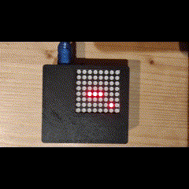

# Snake_game
Classic snake game for Arduino and STM32 microcontrollers. The project uses an 8x8 LED matrix for display and a graphical user interface (GUI) written in Python for controls. The GUI runs on a PC and the commands are sent via USB cable to the microcontroller.

# Description
The code for the snake is contained within two files: Snake_game.h and Snake_game.cpp. These files can be found in Arduino > lib > Snake_game, as well as in STM32 > Snake > Core > Inc/Src folders. The code
